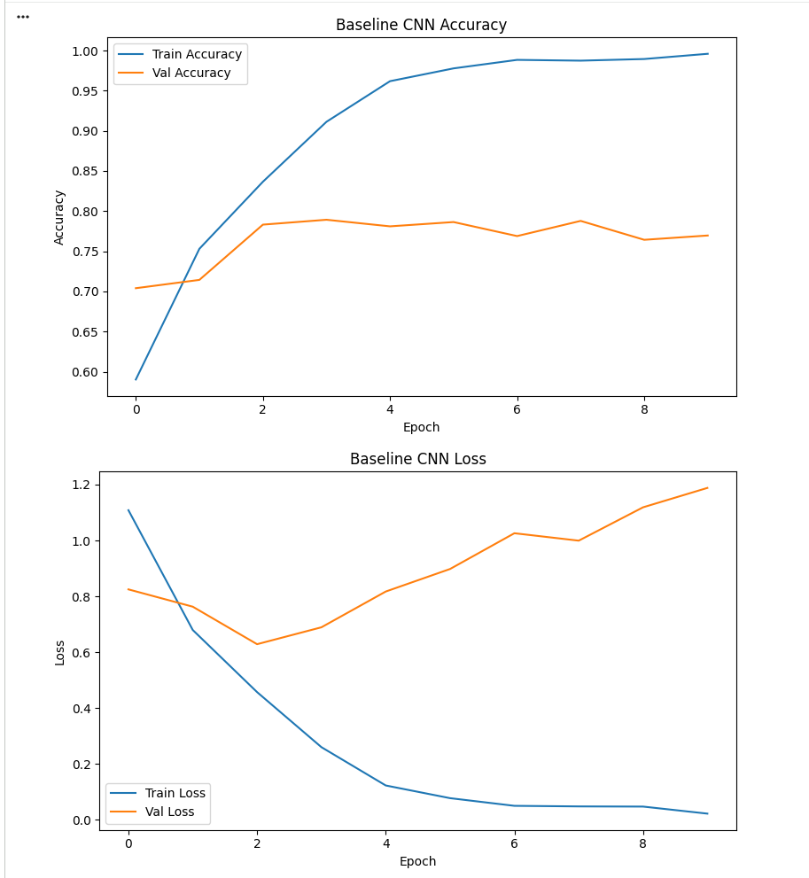
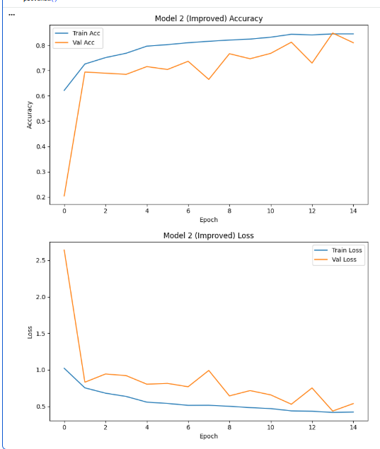

# Dissertation Project – CNN Image Classification

## 1. Project Overview

This project focuses on the design, implementation, and evaluation of a Convolutional Neural Network (CNN) for multi-class image classification. A publicly available dataset from Kaggle is used to classify natural scene images into six categories.

The project follows a complete machine learning pipeline, including dataset acquisition, exploratory data analysis (EDA), data preprocessing, CNN model development, optimisation, and evaluation. All work is implemented in Python using Jupyter Notebooks and tracked through regular GitHub commits.

---

## 2. Repository Structure

The repository is organised as follows:

- notebooks/ – Jupyter notebooks implementing each stage of the ML pipeline  
- images/ – Figures used in documentation  
- data/ – Dataset directory (excluded from version control via .gitignore)  
- README.md – Project documentation  

The notebooks are numbered to reflect the logical execution order of the project.

---

## 3. How to Run This Repository

1. Clone the repository from GitHub.
2. Install the required Python packages.
3. Download the dataset using the Kaggle API (see Section 4).
4. Run the notebooks in numerical order inside the notebooks/ directory.
5. All notebooks are designed to be one-click executable in Google Colab.

---

## 4. Dataset Acquisition (Kaggle)

The dataset used in this project is the Intel Image Classification dataset obtained from Kaggle.

- Dataset name: Intel Image Classification  
- Source: Kaggle  
- Link: https://www.kaggle.com/datasets/puneet6060/intel-image-classification  

The dataset is downloaded programmatically using the Kaggle API within Google Colab. Authentication is performed using a Kaggle API token (kaggle.json), generated via the Kaggle account settings. For security reasons, this file is not stored in the repository.

The dataset is downloaded and extracted using:

kaggle datasets download -d puneet6060/intel-image-classification -p data/ --unzip

This process is implemented in:

notebooks/01_dataset_acquisition.ipynb

---

## 5. Dataset Description

The Intel Image Classification dataset consists of natural scene images belonging to six classes:

- Buildings  
- Forest  
- Glacier  
- Mountain  
- Sea  
- Street  

The dataset is organised into training, testing, and prediction directories. Each class is stored in a separate subdirectory, enabling supervised learning for multi-class image classification.

---

## 6. Project Objective and Success Metrics

The primary objective of this project is to develop a CNN capable of accurately classifying images into one of six predefined categories.

Model performance is evaluated using:
- Classification accuracy  
- Training and validation loss  
- Learning curves  

These metrics are used to compare baseline and improved models.

---

## 7. Exploratory Data Analysis (EDA)

Exploratory Data Analysis was conducted to understand the dataset and guide preprocessing and modelling decisions.

### 7.1 Class Distribution

The number of images per class was analysed. Results indicate a relatively balanced dataset, reducing the need for class weighting during training.

### 7.2 Sample Image Inspection

Random samples from each class were visually inspected. The images clearly correspond to their class labels, confirming the suitability of the dataset for CNN-based image classification.

### 7.3 Image Size Analysis

A random sample of 600 images (100 per class) was analysed. All sampled images have consistent dimensions of 150 × 150 pixels. This uniformity simplifies preprocessing, as no additional resizing is required prior to training.

EDA is implemented in:

notebooks/02_eda.ipynb

---

## 8. Dataset Cleaning and Preprocessing

Images are normalised by rescaling pixel values to the range [0, 1]. The training dataset is split into training (80%) and validation (20%) subsets using Keras ImageDataGenerator.

The test dataset is kept separate and is not used during training to ensure unbiased evaluation.

This stage is implemented in:

notebooks/03_cleaning_and_split.ipynb

---

## 9. CNN Model Development

Three CNN models are developed to demonstrate iterative optimisation and performance improvement.

---

## 9.1 Model 1 – Baseline CNN

A baseline CNN was implemented to establish initial performance and serve as a reference point for subsequent improvements.

### Architecture Overview
- Input size: 150 × 150 × 3  
- Two convolutional layers with ReLU activation  
- Max-pooling layers for spatial downsampling  
- Fully connected dense layer  
- Softmax output layer for six-class classification  

The model was compiled using the Adam optimiser and categorical cross-entropy loss.

### Training Configuration
- Training/validation split: 80% / 20%  
- Batch size: 32  
- Epochs: 10  
- Image normalisation applied  

---

## 9.2 Baseline Model Performance

Training and validation accuracy and loss were recorded across epochs. The learning curves reveal strong performance on the training set, while validation accuracy plateaus and validation loss increases after several epochs.

This behaviour indicates overfitting and motivates the introduction of regularisation and architectural improvements in subsequent models.

### Training and Validation Curves

The baseline model provides a clear performance benchmark against which improved CNN architectures are evaluated.

Training is implemented in:

notebooks/04_model_1_baseline.ipynb

## 9.3 Model 2 – Improved CNN (Data Augmentation)

An improved CNN was developed to reduce overfitting observed in the baseline model and improve generalisation performance.

### Improvements Introduced
- Data augmentation applied to the training dataset  
- Random rotations, shifts, zoom, and horizontal flipping  
- Increased training duration  
- Improved validation stability  

Data augmentation was applied only to the training data, while validation data remained unchanged to ensure fair evaluation.

### Model 2 Training and Validation Performance

Compared to the baseline CNN, Model 2 demonstrates:
- Higher and more stable validation accuracy  
- Reduced validation loss fluctuations  
- Improved resistance to overfitting  

Training is implemented in:

notebooks/05_model_2_improved.ipynb

---

## 10. Data Augmentation

Data augmentation is not applied in the baseline model to ensure that initial performance reflects the inherent capability of the CNN. Augmentation techniques are introduced in later models to improve generalisation and reduce overfitting.

---

## 11. Model Evaluation Strategy

Model evaluation is based on:
- Training accuracy  
- Validation accuracy  
- Training and validation loss  

Evaluation on a held-out test set and predictions on individual images are performed in later stages of the project.

---

## 12. Python Packages Used

Key Python libraries used include:
- NumPy  
- Pandas  
- Matplotlib  
- TensorFlow / Keras  
- Scikit-learn  
- Kaggle API  

---

## 13. Reused Code and References

Any reused or adapted code from external sources is clearly referenced within the notebooks and documentation.

---

## 14. Conclusions

This project demonstrates a complete CNN-based image classification pipeline. The baseline CNN establishes a strong foundation for iterative optimisation and performance improvements.

---

## 15. Future Work

Future work includes:
- Development of a third, optimised CNN model  
- Batch normalisation and dropout regularisation  
- Learning rate scheduling and early stopping  
- Evaluation using confusion matrices and classification reports  
- Deployment as a GUI application using Streamlit  

---

## 16. Known Issues / Bugs

No critical unresolved issues at the current stage of the project.
